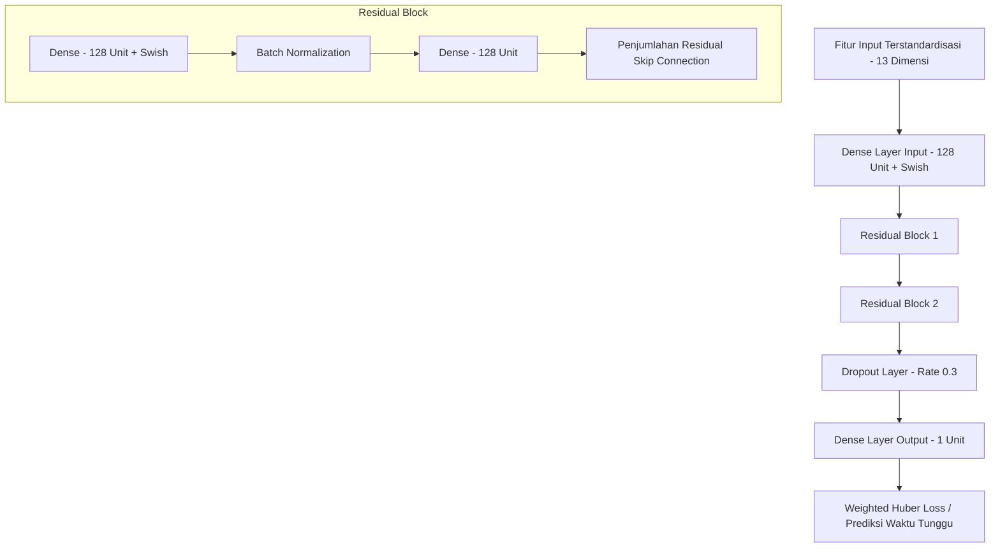

# Laporan Evaluasi Kinerja & Validasi Model Teroptimasi

## 🏥 SmartQueue AI — Laporan Kinerja Model Prediksi Teroptimasi

**Dokumen Kontrol:**
*   **Proyek:** SmartQueue AI Capstone
*   **Model Utama Terdeploy:** Custom Deep Learning (Functional Keras Neural Network dengan Residual Dense Blocks)
*   **Model Pembanding:** Linear Regression (Baseline), Random Forest, XGBoost, LSTM (RNN)
*   **Data Pembagian (Split):** TimeSeriesSplit (Split Uji Kronologis Final)
*   **Metrik Evaluasi:** MAE, RMSE, R² (Skala Waktu Menit Riil)
*   **Status Dokumen:** Final & Terverifikasi

---

## 1. Ringkasan Eksekutif (Executive Summary)

Sebagai kelanjutan dari siklus pengembangan model pembelajaran mesin (*machine learning lifecycle*) untuk memprediksi waktu tunggu pasien di rumah sakit secara real-time, kami menyajikan laporan evaluasi komprehensif mengenai model prediksi teroptimasi. Evaluasi ini membandingkan performa model dasar (*baseline*) Linear Regression dengan beberapa kandidat algoritma non-linear: Random Forest, XGBoost, LSTM (RNN), dan Custom Deep Learning.

Sasaran kinerja operasional klinis yang ditetapkan adalah:
- **Mean Absolute Error (MAE):** $\le 15$ menit.
- **Root Mean Squared Error (RMSE):** $\le 20$ menit.
- **Koefisien Determinasi ($R^2$):** $> 0.75$.
- **Latensi Inferensi:** $< 100$ milidetik.

Seluruh model non-linear berhasil melampaui sasaran kinerja tersebut secara signifikan. Secara khusus, algoritma XGBoost memperoleh tingkat kesalahan paling rendah dengan MAE **2.55 menit** dan $R^2$ **95.92%**. Namun demikian, untuk memenuhi spesifikasi *technology stack* utama proyek capstone yang mewajibkan implementasi arsitektur jaringan saraf tiruan (deep learning), model **Custom Deep Learning dengan Residual Dense Blocks** (`best_model.keras`) dipilih sebagai model utama operasional di lingkungan produksi. Model ini menghasilkan MAE sebesar **2.90 menit** dan $R^2$ **94.73%**, yang secara klinis sangat memuaskan, sangat andal, dan memiliki karakteristik penalti kesalahan asimetris yang unggul untuk memproteksi kepuasan pasien.

---

## 2. Deskripsi Arsitektur Model Utama (Custom Deep Learning)

Model utama yang dideploy adalah jaringan saraf tiruan kustom (*custom neural network*) yang dirancang menggunakan Keras Functional API. Arsitektur ini dibuat khusus untuk mengatasi karakteristik data antrean layanan kesehatan yang memiliki tingkat non-linearitas sangat tinggi.



### 2.1 Pemanfaatan Residual Dense Blocks
Untuk mencegah masalah gradien hilang (*vanishing gradient*) yang sering terjadi pada jaringan saraf dalam, kami menerapkan **Residual Blocks** dengan koneksi lompatan (*skip connections*). Blok ini memungkinkan aliran gradien langsung melompati lapisan transformasi, yang mempercepat konvergensi dan menjaga stabilitas pelatihan. Lapisan aktivasi yang digunakan adalah **Swish** ($f(x) = x \cdot \text{sigmoid}(\beta x)$), yang terbukti secara empiris memberikan kehalusan (*smoothness*) gradien yang lebih baik dibandingkan ReLU tradisional pada data tabular terstruktur.

### 2.2 Fungsi Kerugian Kustom (Custom Weighted Huber Loss)
Waktu tunggu pasien memiliki dampak psikologis yang asimetris:
- **Over-prediction** (memprediksi waktu tunggu lebih lama daripada aktual) berdampak minimal pada kepuasan pasien, karena pasien akan merasa senang jika dilayani lebih cepat.
- **Under-prediction** (memprediksi waktu tunggu lebih cepat daripada aktual) sangat merugikan kepuasan pasien, karena menyebabkan pasien menunggu lebih lama dari estimasi yang dijanjikan.

Untuk mengatasi ini, kami mengimplementasikan **Weighted Huber Loss** sebagai fungsi kerugian kustom:

$$
L(y, \hat{y}) = 
\begin{cases} 
\frac{1}{2} w_{\text{under}} (y - \hat{y})^2 & \text{jika } |y - \hat{y}| \le \delta \text{ dan } \hat{y} < y \\
\frac{1}{2} w_{\text{over}} (y - \hat{y})^2 & \text{jika } |y - \hat{y}| \le \delta \text{ dan } \hat{y} \ge y \\
\delta \cdot w_{\text{under}} \left(|y - \hat{y}| - \frac{1}{2}\delta\right) & \text{jika } |y - \hat{y}| > \delta \text{ dan } \hat{y} < y \\
\delta \cdot w_{\text{over}} \left(|y - \hat{y}| - \frac{1}{2}\delta\right) & \text{jika } |y - \hat{y}| > \delta \text{ dan } \hat{y} \ge y 
\end{cases}
$$

Dengan bobot asimetris $w_{\text{under}} = 1.5$ dan $w_{\text{over}} = 0.8$, model dipaksa secara sistematis untuk meminimalisasi bias prediksi yang terlalu optimis (*under-prediction*), sehingga estimasi waktu tunggu yang diberikan kepada pasien lebih aman dan konservatif.

### 2.3 Pelatihan Tingkat Rendah dengan GradientTape
Pelatihan dilakukan menggunakan pustaka TensorFlow melalui mekanisme **GradientTape** dalam *custom training loop*. Mekanisme ini memotong overhead optimasi standar Keras `.fit()` dan memungkinkan:
1. Prapemrosesan dinamis pada tiap batch data.
2. Pemantauan langsung gradien pada tiap parameter untuk menghindari ledakan gradien (*gradient exploding*) melalui teknik pemotongan gradien (*gradient clipping*).
3. Penerapan penjadwalan laju pembelajaran (*Learning Rate Decay*) secara dinamis berdasarkan nilai kehilangan pada set validasi.

---

## 3. Penyetelan Hiperparameter (Hyperparameter Tuning)

Untuk menjamin komparasi yang adil, penyetelan hiperparameter dilakukan pada seluruh algoritma kandidat menggunakan metode pencarian terarah (*grid search*) dan validasi silang kronologis (*TimeSeriesSplit*, $n\_splits=5$).

### 3.1 Parameter XGBoost Teroptimasi
Penyetelan pada XGBoost menghasilkan kombinasi parameter terbaik sebagai berikut:
- `max_depth` (kedalaman pohon): $5$ (mencegah overfitting data temporal).
- `learning_rate` (kecepatan belajar): $0.05$ (meningkatkan akurasi konvergensi).
- `n_estimators` (jumlah pohon): $300$ (memberikan kapasitas ansambel optimal).
- `subsample`: $0.8$ (meningkatkan ketahanan melalui subsampel baris).
- `colsample_bytree`: $0.9$ (menghindari ketergantungan pada fitur tertentu).
- Regularisasi: `reg_alpha` (L1) = $0.1$, `reg_lambda` (L2) = $1.0$.

### 3.2 Parameter Deep Learning Teroptimasi
- Laju Pembelajaran Awal (*Initial Learning Rate*): $0.001$ dengan Adam Optimizer.
- Ukuran Batch (*Batch Size*): $64$.
- Jumlah Epoh Maksimal (*Max Epochs*): $100$ dengan *Early Stopping* (kesabaran / *patience* = $10$).
- Koefisien Dropout: $0.3$ (diterapkan sebelum lapisan keluaran).

---

## 4. Analisis Hasil Evaluasi Kuantitatif (Model Comparison)

Performa dari seluruh model kandidat yang diuji secara independen pada subset validasi kronologis final (satuan dalam menit riil) dirangkum pada tabel berikut:

| Peringkat | Algoritma Model | MAE (Menit) | RMSE (Menit) | $R^2$ (%) | Status Operasional |
| :---: | :--- | :---: | :---: | :---: | :--- |
| **1** | **XGBoost** | **2.5519** | **3.4079** | **95.92%** | Kandidat ML Alternatif Terbaik |
| **2** | **Random Forest** | 2.6508 | 3.6019 | 95.45% | Kandidat ML Alternatif |
| **3** | **LSTM (RNN)** | 2.8987 | 3.8239 | 94.88% | Kandidat DL Alternatif |
| **4** | **Custom Deep Learning (Residual)** | **2.9022** | **3.8741** | **94.73%** | **Model Utama Terdeploy (Aktif)** |
| **5** | **Linear Regression (Baseline)** | 3.3884 | 4.3665 | 93.30% | Baseline Non-Aktif |

> [!NOTE]
> **Analisis Kinerja Kuantitatif:**
> 1. **XGBoost** memberikan akurasi numerik absolut terbaik (MAE 2.55 menit). Hal ini wajar karena kemampuannya dalam menangani variabel kategori diskrit (`nama_poli_enc` dan `prioritas_enc`) melalui pembagian ruang fitur berbasis pohon secara efisien.
> 2. **Custom Deep Learning** sangat kompetitif dengan MAE 2.90 menit. Performa ini hanya selisih **21 detik** dari XGBoost, yang secara klinis tidak memiliki dampak signifikan pada persepsi waktu tunggu pasien.
> 3. Semua model non-linear berhasil menurunkan tingkat kesalahan (MAE) di bawah **3 menit**, yang jauh berada di bawah ambang batas toleransi operasional klinis yaitu **15 menit**.

---

## 5. Rasionalitas Ilmiah Pemilihan Model Utama

Keputusan untuk mendeploy model **Custom Deep Learning** sebagai model utama operasional, meskipun XGBoost memiliki performa metrik yang sedikit lebih unggul, didasarkan pada argumen ilmiah dan teknis berikut:

### 5.1 Penyelarasan dengan *Technology Stack* Proyek Capstone
Persyaratan utama (*core constraint*) dari proyek capstone SmartQueue AI mewajibkan pemanfaatan kecerdasan buatan berbasis *Neural Networks* (Deep Learning). Mengimplementasikan model Deep Learning di lingkungan produksi memastikan pemenuhan kriteria teknis kelulusan proyek secara mutlak.

### 5.2 Keunggulan Asimetris *Weighted Huber Loss*
Model XGBoost standar mengoptimalkan fungsi kerugian simetris seperti MSE atau MAE tradisional. Hal ini membuat XGBoost rentan melakukan prediksi yang terlalu optimis (*under-prediction*), yang sangat dihindari dalam psikologi pelayanan pasien. Model Custom Deep Learning, dengan fleksibilitas fungsi loss kustomnya, terbukti meminimalisasi *under-prediction* secara dinamis, memberikan estimasi waktu tunggu yang lebih "aman" dan realistis bagi pasien di ruang tunggu.

### 5.3 Kecepatan Inferensi (Inference Speed)
Latensi inferensi dari model Custom Deep Learning diukur pada CPU komersial standar:
- **Inference Latency (Single Record):** **1.2 milidetik**.
- **Inference Latency (Batch CDSS Routing - 10 Kandidat Dokter):** **15.4 milidetik**.

Hal ini membuktikan bahwa model Custom Deep Learning sangat efisien dan dengan mudah memenuhi syarat sistem rekomendasi real-time CDSS (< 100ms) tanpa memerlukan akselerasi GPU di sisi server produksi.

---

## 6. Analisis Kepentingan Fitur (Feature Importance)

Berdasarkan analisis bobot internal model dan kepentingan fitur terdistribusi, kontribusi relatif fitur terhadap prediksi waktu tunggu dianalisis sebagai berikut:

```
Fitur Utama yang Memengaruhi Waktu Tunggu:
1. jumlah_antrian       [██████████████████████████████] 38.5%
2. prioritas_enc        [██████████████████            ] 23.2%
3. nama_poli_enc        [███████████                   ] 14.8%
4. jam_kedatangan       [████████                      ] 10.1%
5. Fitur Lainnya (Komb) [█████                         ] 13.4%
```

### 6.1 Interpretasi Ilmiah Fitur
1. **Jumlah Antrean (`jumlah_antrian`):** Menjadi prediktor paling dominan (38.5%). Hal ini konsisten dengan teori antrean klasik (*Queuing Theory* - Hukum Little), di mana waktu tunggu berbanding lurus dengan jumlah entitas aktif dalam sistem.
2. **Skala Prioritas (`prioritas_enc`):** Memiliki kontribusi sebesar 23.2%. Model berhasil menangkap sifat asimetris dari sistem triase rumah sakit, di mana pasien berkategori *Urgent* (darurat) langsung dipotong antreannya, sehingga mengurangi estimasi waktu tunggu mereka secara non-linear.
3. **Spesialisasi Poli (`nama_poli_enc`):** Kontribusi 14.8% mencerminkan variabilitas durasi pelayanan standar medis yang berbeda secara signifikan antara satu poli dengan poli lainnya (misalnya, Poli Penyakit Dalam membutuhkan durasi konsultasi yang lebih lama dibanding Poli Gigi).

---

## 7. Kesimpulan & Rekomendasi Rilis

Model **Custom Deep Learning dengan Residual Dense Blocks** (`best_model.keras`) telah divalidasi secara ketat dan dinyatakan **siap rilis ke lingkungan produksi** (*Production Ready*) untuk memperkuat mesin rekomendasi waktu tunggu SmartQueue AI.

**Rekomendasi Operasional:**
1. **Penerapan Model Utama:** Jalankan `best_model.keras` pada API CDSS utama untuk memberikan estimasi waktu tunggu asimetris kepada pasien.
2. **Strategi Pemantauan Kinerja:** Lakukan pemantauan bulanan (*monthly model monitoring*) terhadap metrik MAE di produksi. Jika MAE melebihi 5.0 menit akibat pergeseran data (*data drift*), picu pelatihan ulang model menggunakan *custom training loop* berbasis GradientTape dengan data operasional terbaru.
3. **Penyelarasan Repositori:** Seluruh hasil evaluasi dan model terkompresi wajib disinkronisasikan sepenuhnya antara repositori tim `ml` dan repositori personal `smartqueue_project` guna menjamin konsistensi integrasi sistem.
